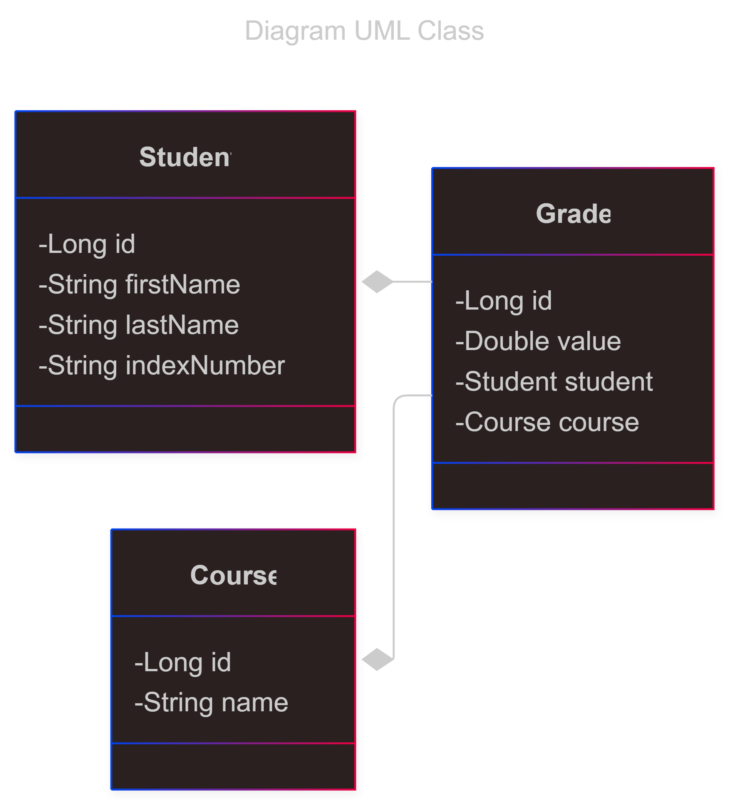

# Distributed Student Management System
**Course: Advanced Object-Oriented Programming**\
**Technologies:** Java, JavaFX
---
## Table of contents
- [Original Assignment](#original-assignment)
- [Tasks](#Tasks)
  - [Task 1](#task-1)❌
  - [Task 2](#task-2)❌
  - [Task 3](#task-3)❌
  - [Task 4](#task-4)❌

---
## Original assignment

### Scenariusz
Student to obiekt, posiadający standardowe pola, imię, nazwisko, numer indeksu.

Student posiada również oceny z przedmiotów.

Zbiór przedmiotów można modyfikować.

Student może mieć 0 lub jedną ocenę z przedmiotu.

Operacje dostępne w programie, to:

1. Dodaj/usuń studenta
2. Dodaj/usuń przedmiot
3. Modyfikacja listy przedmiotów i ocen dla wybranego studenta
4. Wyświetl listę przedmiotów z ocenami dla wybranego studenta.
5. Wyświetl listę przedmiotów wybranych chociaż raz przez któregoś ze studentów wraz ze średnią oceną

Uważaj na zachowanie więzów integralności (JPA przychodzi tu z pomocą)

1. Jeżeli usuwamy przedmiot, to są usuwane wszystkie oceny uzyskane przez studentów dla tego przedmiotu
2. Jeżeli usuwamy studenta - usuwane są wszystkie jego oceny
3. Student na liście ocen nie może mieć dwa lub więcej razy tego samego przedmiotu.

### Realizacja ćwiczenia
Celem ćwiczenia jest wykonanie aplikacji składającej się z trzech komponentów (tutaj osobnych, działających równocześnie aplikacji):
- klient
- serwer
- baza danych

Klient łączy się z serwerem poprzez mechanizm RMI (pod spodemSockety), natomiast serwer łączy się z bazą danych poprzez JPA (pod spodem JDBC).

Baza danych jest postawiona na MySQL, np. na programie XAMPP. Można też użyć postresql lub sqlite.

Każdy z komponentów może stać na innej maszynie. Ponieważ pracę wykonujemy w zespołach dwuosobowych proszę o zaprezentowanie jej działania w ten sposób, że klient, oraz baza MySQL są na jednej maszynie a serwer na drugiej maszynie. Aby przygotować sprawną prezentację, należy zbadać, czy ruch sieciowy jest przepuszczany i ewentualnie wprowadzić tymczasowe zmiany na zaporze.

### Zadanie 1
Przemyśl model danych i przygotuj diagram UML klas oraz diagram relacji bazy danych.

### Zadanie 2
Przygotuj model Encji JPA.

Zaproponuj i zaimplementuj odpowiednie relacje many-to-one (lub many-to-many) - zobacz [przykład](http://www.mkyong.com/hibernate/hibernate-one-to-many-relationship-example/)

Model powinien sam generować bazę danych MySQL. Sprawdź, czy powstała baza jest taka, jak zaproponowaliście w zadaniu 1

### Zadanie 3
Przygotuj aplikację serwerową - program konsolowy wielowątkowy.

Aplikacja powinna obsługiwać zapytania CRUD na przygotowanym modelu JPA i zapisywać stan w obiekcie zdalnym RMI.

### Zadanie 4
Przygotuj aplikację kliencką.

Klient jest aplikacją JavaFX. Może wyglądać tak lub podobnie.

Klient jest zrealizowany w technologii Model / Widok / Prezenter. Należy przygotować klasę modelu wstrzykiwaną do widoku. Kontroler obsługuje zdarzenia. **Zakładamy, że nie ma drugiego klienta.**

Klient wymienia informację z serwerem poprzez metody obiektu zdalnego RMI.

### Uwaga co do łączności sieciowej
Komunikacja sieciowa powinna być obsługiwana w osobnym wątku. W przypadku aplikacji okienkowej jest to konieczne, ponieważ oczekiwanie na przyjęcie danych z sieci jest blokujące i mogłoby spowodować zablokowanie interfejsu graficznego.

---
## Tasks
### Task 1
Diagram UML klas

Diagram relacji bazy danych

### Task 2

### Task 3

### Task 4

---
