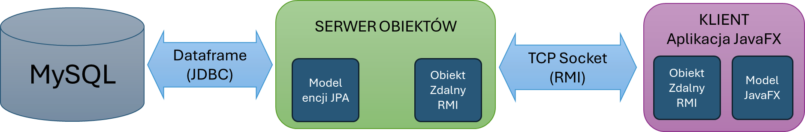
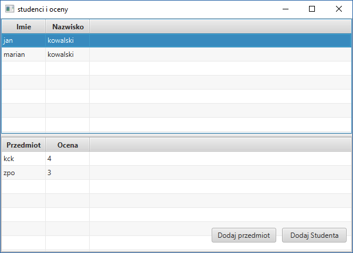
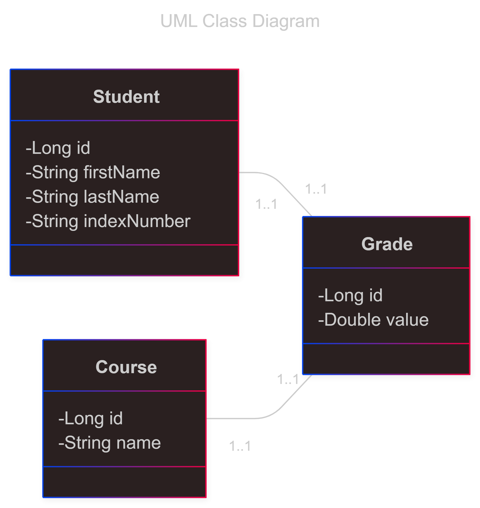
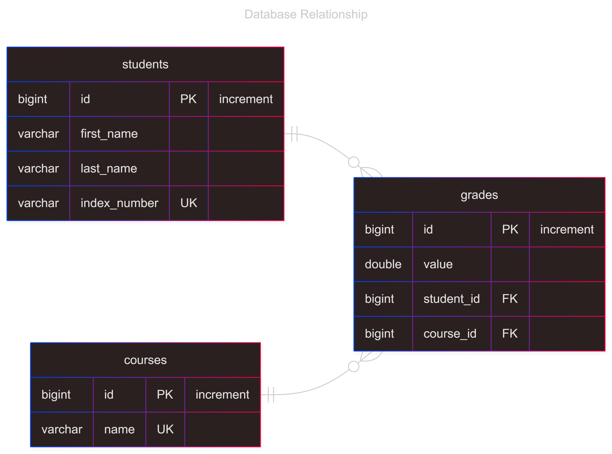
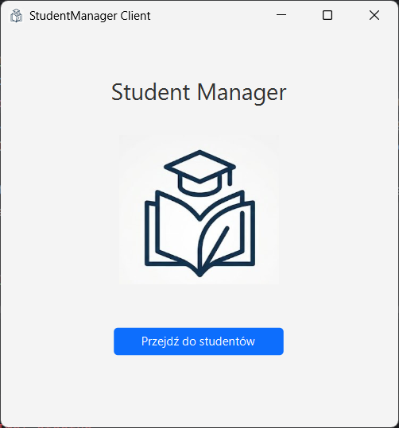

# Distributed Student Management System

**Course: Advanced Object-Oriented Programming**\
**Technologies:** Java, JavaFX
---

## Table of contents

- [Original Assignment](#original-assignment)
- [Tasks](#Tasks)
    - [Task 1](#task-1)✅
    - [Task 2](#task-2)✅
    - [Task 3](#task-3)✅
    - [Task 4](#task-4)✅

---

## Original assignment

### Scenariusz

Student to obiekt, posiadający standardowe pola, imię, nazwisko, numer indeksu.

Student posiada również oceny z przedmiotów.

Zbiór przedmiotów można modyfikować.

Student może mieć 0 lub jedną ocenę z przedmiotu.

Operacje dostępne w programie, to:

1. Dodaj/usuń studenta
2. Dodaj/usuń przedmiot
3. Modyfikacja listy przedmiotów i ocen dla wybranego studenta
4. Wyświetl listę przedmiotów z ocenami dla wybranego studenta.
5. Wyświetl listę przedmiotów wybranych chociaż raz przez któregoś ze studentów wraz ze średnią oceną

Uważaj na zachowanie więzów integralności (JPA przychodzi tu z pomocą)

1. Jeżeli usuwamy przedmiot, to są usuwane wszystkie oceny uzyskane przez studentów dla tego przedmiotu
2. Jeżeli usuwamy studenta - usuwane są wszystkie jego oceny
3. Student na liście ocen nie może mieć dwa lub więcej razy tego samego przedmiotu.

### Realizacja ćwiczenia

Celem ćwiczenia jest wykonanie aplikacji składającej się z trzech komponentów (tutaj osobnych, działających równocześnie
aplikacji):

- klient
- serwer
- baza danych



Klient łączy się z serwerem poprzez mechanizm RMI (pod spodemSockety), natomiast serwer łączy się z bazą danych poprzez
JPA (pod spodem JDBC).

Baza danych jest postawiona na MySQL, np. na programie XAMPP. Można też użyć postresql lub sqlite.

Każdy z komponentów może stać na innej maszynie. Ponieważ pracę wykonujemy w zespołach dwuosobowych proszę o
zaprezentowanie jej działania w ten sposób, że klient, oraz baza MySQL są na jednej maszynie a serwer na drugiej
maszynie. Aby przygotować sprawną prezentację, należy zbadać, czy ruch sieciowy jest przepuszczany i ewentualnie
wprowadzić tymczasowe zmiany na zaporze.

### Zadanie 1

Przemyśl model danych i przygotuj diagram UML klas oraz diagram relacji bazy danych.

### Zadanie 2

Przygotuj model Encji JPA.

Zaproponuj i zaimplementuj odpowiednie relacje many-to-one (lub many-to-many) -
zobacz [przykład](http://www.mkyong.com/hibernate/hibernate-one-to-many-relationship-example/)

Model powinien sam generować bazę danych MySQL. Sprawdź, czy powstała baza jest taka, jak zaproponowaliście w zadaniu 1

### Zadanie 3

Przygotuj aplikację serwerową - program konsolowy wielowątkowy.

Aplikacja powinna obsługiwać zapytania CRUD na przygotowanym modelu JPA i zapisywać stan w obiekcie zdalnym RMI.

### Zadanie 4

Przygotuj aplikację kliencką.

Klient jest aplikacją JavaFX. Może wyglądać tak lub podobnie.



Klient jest zrealizowany w technologii Model / Widok / Prezenter. Należy przygotować klasę modelu wstrzykiwaną do
widoku. Kontroler obsługuje zdarzenia. **Zakładamy, że nie ma drugiego klienta.**

Klient wymienia informację z serwerem poprzez metody obiektu zdalnego RMI.

### Uwaga co do łączności sieciowej

Komunikacja sieciowa powinna być obsługiwana w osobnym wątku. W przypadku aplikacji okienkowej jest to konieczne,
ponieważ oczekiwanie na przyjęcie danych z sieci jest blokujące i mogłoby spowodować zablokowanie interfejsu
graficznego.

---

## Tasks

### Task 1

**Diagram UML klas**

<div align="center">
  
</div>

**Diagram relacji bazy danych**
<div align="center">
  
</div>

### Task 2

#### Model Encji JPA

##### Model klasy `Grade`

```java

@Entity
@Table(name = "grades",
        uniqueConstraints = {
                @UniqueConstraint(columnNames = {"student_id", "course_id"})
        }
)
public class Grade implements Serializable {

    @Id
    @GeneratedValue(strategy = GenerationType.IDENTITY)
    private Long id;

    @Column(nullable = false)
    private Double value;

    @ManyToOne(optional = false)
    @JoinColumn(name = "student_id", nullable = false)
    @OnDelete(action = OnDeleteAction.CASCADE)
    private Student student;

    @ManyToOne(optional = false)
    @JoinColumn(name = "course_id", nullable = false)
    @OnDelete(action = OnDeleteAction.CASCADE)
    private Course course;
//...
}
```

Encja `Grade` reprezentuje ocenę uzyskaną przez studenta z konkretnego przedmiotu, realizując relacje _many-to-one_
względem encji Student oraz Course. W klasie zdefiniowano unikalne więzy integralności dla pary `student_id` i
`course_id`,
co uniemożliwia wystawienie studentowi więcej niż jednej oceny z tego samego przedmiotu. Dodatkowo mechanizm
`OnDeleteAction.CASCADE` zapewnia automatyczne usunięcie oceny w przypadku usunięcia powiązanego studenta lub kursu.

##### Model klasy `Student`

```java

@Entity
@Table(name = "students")
public class Student implements Serializable {

    @Id
    @GeneratedValue(strategy = GenerationType.IDENTITY)
    private Long id;

    @Column(name = "first_name", nullable = false)
    private String firstName;

    @Column(name = "last_name", nullable = false)
    private String lastName;

    @Column(name = "index_number", nullable = false, unique = true)
    private String indexNumber;

    public Student() {
    }

    public Student(String firstName, String lastName, String indexNumber) {
        this.firstName = firstName;
        this.lastName = lastName;
        this.indexNumber = indexNumber;
    }
//...
}
```

Encja `Student` jest mapowana na tabelę `students` i przechowuje dane osobowe, takie jak imię, nazwisko oraz numer
indeksu.
Pole `indexNumber` zostało oznaczone jako unikalne (`unique = true`), co gwarantuje, że w systemie nie mogą istnieć dwie
osoby o tym samym numerze indeksu. Klasa ta stanowi stronę dominującą w relacjach z ocenami.

##### Model klasy `Course`

```java

@Entity
@Table(name = "courses")
public class Course implements Serializable {

    @Id
    @GeneratedValue(strategy = GenerationType.IDENTITY)
    private Long id;

    @Column(name = "name", nullable = false, unique = true)
    private String name;
//...
}
```

Encja `Course` odpowiada za reprezentację przedmiotu w systemie, przechowując jego nazwę w tabeli `courses`.
Pole `name` posiada atrybut `unique = true`, co zapobiega wprowadzeniu do bazy danych duplikatów przedmiotów o tej samej
nazwie. Obiekty tej klasy są wykorzystywane w encji Grade do przypisania oceny do konkretnych zajęć.

### Task 3

Zaproponowaliśmy poniższą strukturę projektu:

```githubexpressionlanguage
StudentManager
├───client
│   └───src
│       └───main
│           ├───java
│           │   └───com
│           │       └───studentmanager
│           │           └───client
│           └───resources
├───docs-resources
├───server
│   └───src
│       └───main
│           └───java
│               └───com
│                   └───studentmanager
│                       └───server
└───shared
    └───src
        └───main
            ├───java
            │   └───com
            │       └───studentmanager
            │           └───shared
            └───resources
                └───META-INF
```

Rozdzieliliśmy logikę programu na 3 moduły: `Client`, `Server` i `Shared`. (+moduł przechowujący multimedia do docs -
`docs-resources`). W `server/src/main/java/com/studentmanager/server` znajdują się klasy `Main` - inicjująca `RMI` i
drugą klasę - `ServerImpl` - odpowiedzialną za logikę obsługiwania klienta.

Aby uruchomić poprawnie serwer, należy w `Main` skonfigurować `ip` oraz `port` na którym będzie działać, oraz w
`shared/src/main/resources` stworzyć plik o nazwie `db.properties`, który zawiera dane dostępu do bazy danych w
następującym formacie:
```properties
db.user=DB_USER
db.password=PASSWORD
db.url=DB_URL
```

### Task 4
Po uruchomieniu aplikacji klienckiej wyświetla się wstępne okienko

<div style="display: flex; justify-content: center; width: 100%;">
  
</div>
